# claude-to-codex

> Convert any Claude skill into a ready-to-use Codex skill — automatically.
> Search by name, fetch, transform, validate, and install in one command.
> Use Claude skills in your Codex workflows

---

## Why this exists

Claude and Codex skills share a similar structure, but small differences in tool
naming and configuration can break compatibility. This tool automates the
migration so you can run your favorite Claude skills directly within the Codex
CLI.

| | Claude Code | Codex CLI |
|---|---|---|
| Task tracking | `TodoWrite`, `TodoRead` | Checklist in response |
| Shell execution | `Bash tool` | Shell directly |
| Web search | `WebSearch tool` | `Search the web for...` |
| File operations | `Read`, `Write`, `Edit` tools | Shell commands |
| Sub-agents | `Task tool` | `spawn_agent` (explicit prompt) |
| Config file | `CLAUDE.md` | `AGENTS.md` |
| App metadata | Not required | `agents/openai.yaml` |
| Frontmatter fields | name, description, license, model… | name + description only |

`$claude-to-codex` handles the tool substitutions, rewrites frontmatter,
generates `agents/openai.yaml`, can validate the output, and writes the result
to `.codex/skills/` or `~/.codex/skills/`.

---

## New In This Fork

- Search results are now labeled by trust tier: `official`, `community`, or
  `scraped`.
- Community GitHub matches and Skills Playground fallbacks stay supported, but
  now require explicit warning acknowledgement before conversion continues.
- Install paths are derived from a sanitized confirmed slug instead of raw user
  input, with path-boundary checks before any write.
- Risky or ambiguous source lines stay visible with `# REVIEW` instead of being
  silently normalized.
- Candidate MCP entries are detected but require explicit approval before being
  written into `agents/openai.yaml`.
- A lightweight prompt-contract validator and CI workflow now protect the skill
  docs from drifting back into unsafe guidance.

When `--dry-run` is set, generate the transformed output and validation report
without writing any files.

When `--dry-run` and `--test` are combined, validate the generated content in
memory rather than from written files.

Candidate MCP entries require explicit user approval before inclusion in
`agents/openai.yaml`.

`--overwrite` skips only the existing-directory overwrite prompt.

---

## How it works

Search: Finds the skill in the marketplace and labels each result with a trust
tier.

Confirm: Shows the chosen source URL, trust tier, and risk note before
continuing.

Transform: Maps Claude tools to Codex equivalents line-by-line and preserves
risky lines with `# REVIEW`.

Generate: Creates the required `agents/openai.yaml` metadata after MCP approval.

Install: Writes the final version to your `.codex/skills/` directory or previews
it with `--dry-run`.

```mermaid
flowchart LR
    A(["$claude-to-codex\ndocx --test"])

    A --> B["1 Search\nmarketplace + trust tier"]
    B --> C["2 Confirm\nmatch + risk"]
    C --> D["3 Fetch\nSKILL.md"]
    D --> E["4 Analyse\nClaude refs + safety"]
    E --> F["5 Transform\nline by line"]
    F --> G["6 Approve MCP +\nGenerate openai.yaml"]
    G --> H["7 Write or preview\n.codex/skills/"]
    H --> I["7b Validate\nskill-creator rules"]
    I --> J(["8 Report\nsummary"])

    style A fill:#e1f5ee,stroke:#0f6e56,color:#085041
    style J fill:#e1f5ee,stroke:#0f6e56,color:#085041
    style I fill:#faeeda,stroke:#854f0b,color:#633806
```



The `--test` step (7b) is optional. Without it, the skill goes straight from
write or preview → report.

---

## How to Install and Convert Your First Skill

```bash
# 1. Clone and install globally
git clone https://github.com/<you>/claude-to-codex.git
mkdir -p ~/.codex/skills/claude-to-codex
cp -r claude-to-codex/. ~/.codex/skills/claude-to-codex/

# 2. Open Codex with live search (needed for marketplace lookups)
codex --search

# 3. Convert your first skill
$claude-to-codex docx
```

The skill will ask for confirmation before touching anything:
1. **Confirm the match** — shows source URL, trust tier, and risk note
2. **Acknowledge source risk** — only for `community` or `scraped` sources
3. **Where to install** — project-local or global (skip with `--global` or
   preview only with `--dry-run`)

---

## Usage

```text
$claude-to-codex <skill-name> [flags]
```

### Flags

| Flag | Description |
|---|---|
| `--global` | Install to `~/.codex/skills/` instead of `.codex/skills/` |
| `--dry-run` | Preview the transformed output and validation report without writing files |
| `--no-yaml` | Skip generating `agents/openai.yaml` |
| `--overwrite` | Skip only the existing-directory overwrite prompt |
| `--multi-agent` | Explorer + worker sub-agents for fetch, analysis, and transform |
| `--test` | Validate output; with `--dry-run`, validate generated content in memory |

---

## Examples

### Basic conversion

```bash
$claude-to-codex docx
```

The skill confirms the source before touching anything:

```text
Found `docx` by anthropics
Source: https://github.com/anthropics/skills/blob/main/skills/docx/SKILL.md
Trust tier: official
Risk: Official Anthropic source. Review still recommended before use.
Proceed with conversion? (y/n): y

Where should I install the converted skill?

  1. This project only   -> .codex/skills/docx/
  2. Global (all projects) -> ~/.codex/skills/docx/

Enter 1 or 2: 1

✓ Written to .codex/skills/docx/
```

---

### Preview before committing

```bash
$claude-to-codex pptx --dry-run
```

Prints the transformed `SKILL.md`, the resolved target path, the source trust
summary, and `agents/openai.yaml` to the terminal without writing any files.
Use this to review changes before installing.

---

### Install globally for all projects

```bash
$claude-to-codex git-commit --global
```

Writes to `~/.codex/skills/git-commit/` so the skill is available in every
project on your machine, not just the current one.

---

### Fuzzy name search

```bash
$claude-to-codex "write commit message" --dry-run
```

The skill searches the marketplace with your phrase and shows a numbered list if
multiple results match. Every result includes a trust tier before you choose:

```text
Found 3 results for "write commit message":

  1. git-commit      (anthropics/skills)   [official]
  2. commit-helper   (community)           [community]
  3. conventional-commits (skillsplayground) [scraped]

Pick a number (1–3):
```

---

### Convert with validation

```bash
$claude-to-codex docx --test
```

After generating the files, runs a validation pass covering frontmatter,
description quality, `# REVIEW` lines, and `agents/openai.yaml`.

---

### Full pipeline — convert, validate with independent tester

```bash
$claude-to-codex docx --multi-agent --test
```

The strictest mode. Three roles are involved:

```text
Explorer (gpt-5.4-mini)  -> fetch + analyse
Worker   (gpt-5.4)       -> transform
You                     -> trust prompts, MCP approval, yaml, validation, report
```

If files are written, validation may still use an independent cold-read tester
after generation.

---

## Edge Cases

| Situation | Behaviour |
|---|---|
| Skill not found | Reports clearly, offers alternate query |
| Fetch fails | Lists every URL tried, stops |
| Unsafe or invalid slug | Stops before writing files |
| Path escapes skills directory | Stops before writing files |
| Skill already exists | Asks before overwriting — bypass only that prompt with `--overwrite` |
| Unknown tool reference | Flags with `# REVIEW`, never silently drops |
| Risky source instruction | Preserves with `# REVIEW`, never silently normalizes |
| MCP tool reference | Preserves in the body and asks for approval before adding to `mcp_servers` |
| Cached web search mode | Warns user, recommends `--search` flag |

---

## Repo Checks

This fork includes a lightweight prompt-contract validator:

```bash
python3 scripts/validate_prompt_contract.py
```

It catches:
- tracked paths that begin with whitespace
- duplicate step headers in `SKILL.md`
- forbidden frontmatter guidance such as `invocation` returning to
  `references/tool-map.md`
- missing trust-tier, path-safety, or MCP-approval language
- drift between `README.md` and `SKILL.md` for `--dry-run`, `--test`, and MCP
  behavior

---

## Repo Structure

```text
claude-to-codex/
  SKILL.md
  README.md
  agents/
    openai.yaml
  references/
    tool-map.md
    codex-tool-dictionary.md
  scripts/
    validate_prompt_contract.py
```
